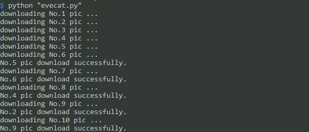

## eveonecat

多线程下载[EverydayOneCat](http://motions.cat/top.html)网站的所有gif

### 使用方法

直接运行：
```sh
python eveonecat.py
```



自定义下载线程数以及下载目录：
```python
# 设置最大线程数，开启5个线程就锁住
thread_lock=threading.BoundedSemaphore(value=5)
# 设置下载目录
pic_dir = "pics/"
```
