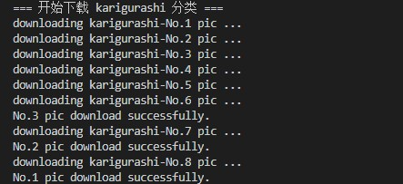

## ghibli

多线程下载[Ghibli 作品静止画](http://www.ghibli.jp/works/)网站的所有分类图片

### 使用方法

直接运行：
```sh
python ghibli.py
```



自定义下载线程数以及下载分类：
```python
# 设置最大线程数
thread_lock=threading.BoundedSemaphore(value=5)
# 设置下载分类，可从网页 url 中找到，如 http://www.ghibli.jp/works/chihiro
pic_ca = ["chihiro"]
```
